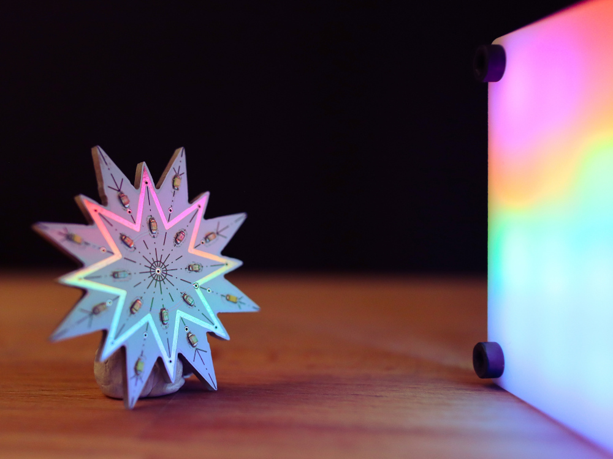

# PicoLight 🌈

✨ PicoLight is a minimalist adjustable light for low-light photography, based on the Raspberry Pi Pico.

✨ For more details check out [https://www.hackster.io/alexandracovor/picolight-minimalist-light-for-product-shots-e19caa](Hackster)

